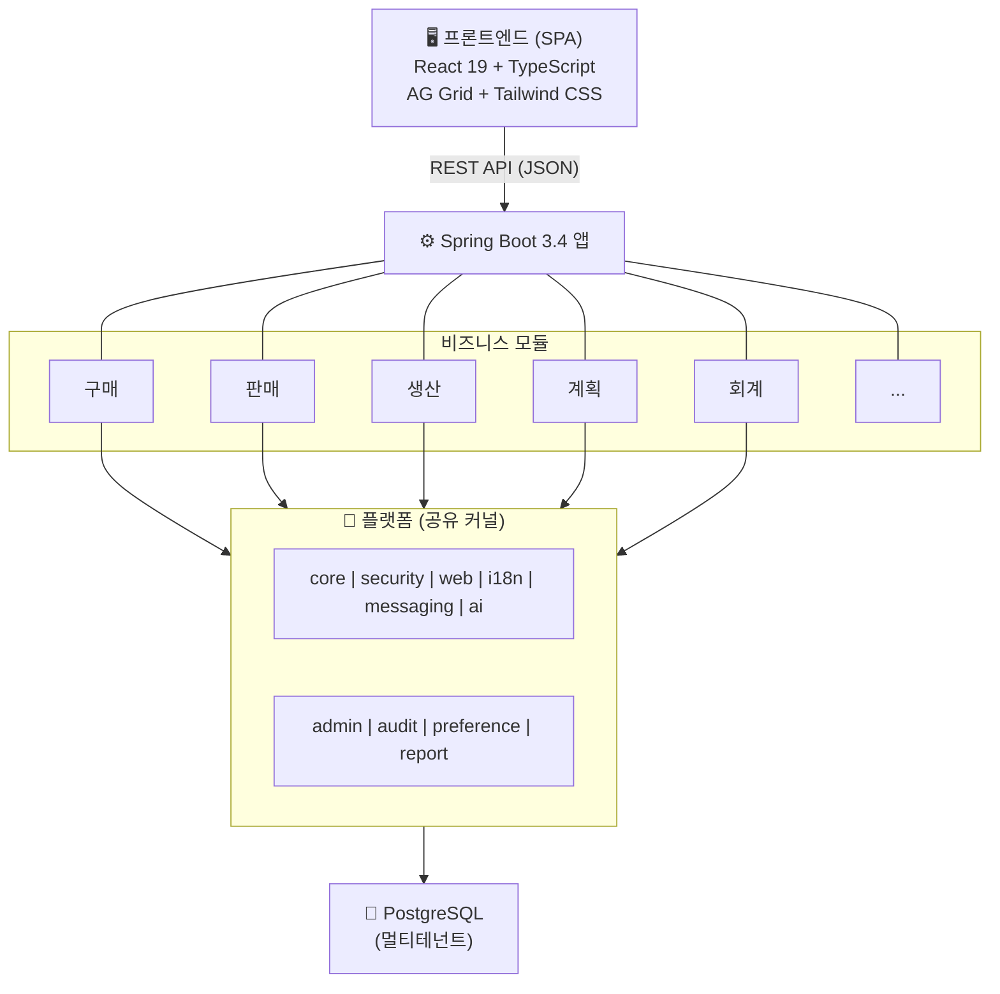
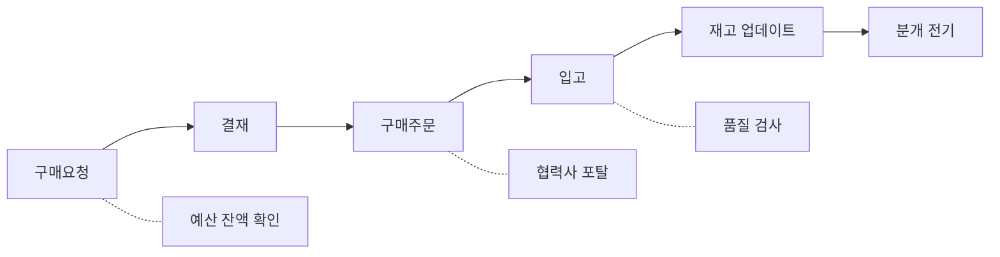
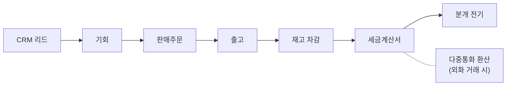
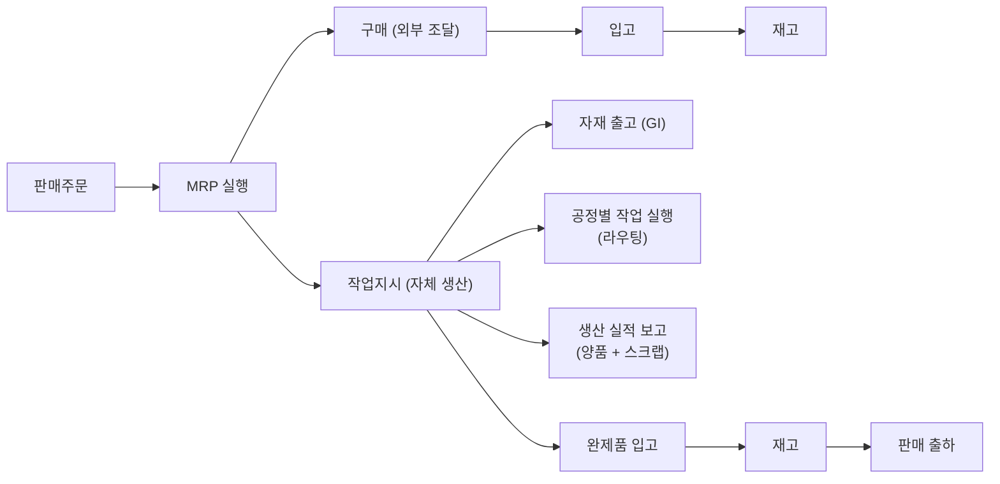
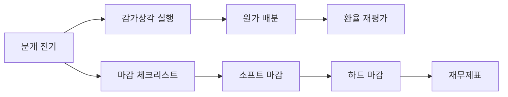
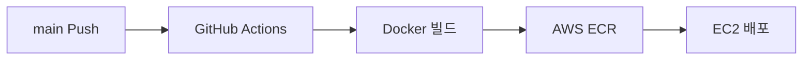

<div align="center">

# ModularERP

**엔터프라이즈급 멀티테넌트 SaaS ERP 플랫폼 (AI 통합)**

[](https://spring.io/projects/spring-boot)
[](https://kotlinlang.org)
[](https://react.dev)
[](https://www.typescriptlang.org)
[](https://www.postgresql.org)
[](LICENSE)
[](#테스트)

---

[English](README.md) | [한국어](#개요)

<br/>


</div>

---

## 개요

ModularERP는 멀티테넌트 SaaS 배포를 위해 설계된 현대적 클라우드 네이티브 ERP 플랫폼입니다. 클린 아키텍처 원칙으로 처음부터 구축되었으며, 구매/생산/재무/AI 기반 분석까지 기업 운영의 전체 스펙트럼을 아우릅니다.

### 왜 ModularERP인가?

| 기존 문제 | ModularERP의 해결 방식 |
|-----------|----------------------|
| 레거시 ERP는 모놀리식이고 경직됨 | 독립적인 비즈니스 모듈 구조의 모듈러 아키텍처 |
| 온프레미스 전용, 비싼 배포 비용 | 멀티테넌트 격리를 갖춘 클라우드 네이티브 SaaS |
| AI 기능 부재 | RAG 기반 AI 챗봇, 자연어 쿼리 내장 |
| 고객별 커스터마이징 어려움 | 테넌트별 설정, 필드 권한, 워크플로우 디자이너 |
| 열악한 개발자 경험 | Kotlin + React + TypeScript, 핫 리로드, OpenAPI 문서 |

---

## 아키텍처



**모듈 의존성 규칙**

- 비즈니스 모듈은 서로 **직접 의존하지 않음**
- 모듈 간 통신은 `platform:core`의 **Port/Adapter** 인터페이스를 통해 수행
- 현재 모놀리스, 향후 MSA 전환 가능 — 어댑터만 REST/이벤트 클라이언트로 교체
- 각 모듈은 독립적인 Gradle 서브프로젝트 (도메인, 레포지토리, 서비스, 컨트롤러, DTO 계층)

---

## 모듈

### 플랫폼 계층

| 모듈 | 용도 |
|------|------|
| `platform:core` | BaseEntity, TenantEntity, DomainEvent, Port 인터페이스, Value Objects |
| `platform:security` | JWT 인증, API 키 인증, 레이트 리미팅, 테넌트 격리, RBAC, SSO 인프라 |
| `platform:web` | ApiResponse 래퍼, 전역 예외 핸들러, Correlation ID, 요청 로깅 |
| `platform:admin` | 테넌트, 역할, 권한, 조직, 시스템 코드, 필드 권한, 메뉴 프로필 |
| `platform:ai` | AI 채팅 서비스, RAG 엔진, 자연어 쿼리, ERP 도구 레지스트리, WebSocket 스트리밍 |
| `platform:report` | Excel/PDF/CSV 내보내기 엔진, 보고서 템플릿, 스케줄링 보고서 |
| `platform:audit` | 감사 추적 로깅 |
| `platform:preference` | 사용자 설정, 그리드 컬럼 커스터마이징 |
| `platform:i18n` | 다국어 번역 인프라 |
| `platform:messaging` | 인프로세스 이벤트 퍼블리셔 (Kafka 전환 가능) |

### 비즈니스 모듈

| 모듈 | 엔티티 | 주요 기능 |
|------|--------|----------|
| `master-data` | Item, Company, Plant, BOM | 다단계 BOM, 팬텀 품목, 다국어 번역 |
| `purchase` | PR, RFQ, PO | 구매요청 -> 견적요청 -> 구매주문 플로우, PR-PO 전환 |
| `sales` | SalesOrder | 주문 -> 출하 -> 완료 생명주기 |
| `logistics` | GoodsReceipt, GoodsIssue, StockSummary | 입/출고 확인 시 재고 자동 업데이트, 평균원가 |
| `production` | WorkCenter, Routing, WorkOrder | BOM/라우팅 자동 적용, 수율, 스크랩 추적 |
| `planning` | MrpRun, ProductionSchedule, CapacityPlan | MRP 엔진 (BOM 전개), 소요량 계산 |
| `account` | JournalEntry, AccountMaster | 복식부기, 차대변 균형 검증, 전기/역분개 |
| `approval` | ApprovalRequest, WorkflowDefinition | 동적 워크플로우 디자이너, 결재 위임, 다단계 승인 |
| `budget` | BudgetPeriod, BudgetItem, BudgetTransfer | 예산 대비 실적 분석, 예산 이체, 잔액 확인 |
| `asset` | Asset, DepreciationSchedule, AssetDisposal | 3가지 감가상각 방법, 일괄 감가상각, 처분 손익 |
| `period-close` | FiscalPeriod, PeriodCloseTask, ClosingEntry | 마감 체크리스트, 소프트/하드 마감, 결산 분개 |
| `crm` | Customer, Lead, Opportunity, Activity | 리드 전환, 파이프라인 단계, 매출 퍼널 분석 |
| `costing` | CostCenter, StandardCost, ProductCost | BOM 기반 원가 계산, 차이 분석, 원가 배분 |
| `currency` | Currency, ExchangeRate, CurrencyRevaluation | 다중통화 변환, 기말 환율 재평가 |
| `batch` | BatchJob, BatchExecution | 스케줄링 작업, 실행 이력, 재시도 메커니즘 |
| `notification` | NotificationTemplate, Notification | 다채널 (인앱, 이메일, SMS), 템플릿 변수, 수신 설정 |
| `hr` | Employee, Department | 직원 마스터, 부서 계층 |
| `quality` | QualityInspection | 수입/공정/최종 검사 |
| `supply-chain` | SupplierEvaluation | 가중치 기반 평가 (품질, 납기, 가격, 서비스) |
| `contract` | Contract | 다중 유형 (구매, 판매, NDA, 기본 계약) |
| `document` | DocumentSequence | 유형/기간별 원자적 문서 채번 |

---

## 비즈니스 프로세스

### 구매-지급 (P2P)



### 주문-수금 (O2C)



### 생산



### 결산



---

## AI 어시스턴트

ModularERP는 LLM + RAG (검색증강생성) 기반의 AI 어시스턴트를 내장하고 있습니다.

| 기능 | 설명 |
|------|------|
| **자연어 쿼리** | "지난달 거래처별 매출 보여줘" — 자동으로 ERP 쿼리로 변환 |
| **보고서 생성** | "월간 구매 보고서 Excel로 만들어줘" — 다운로드 가능한 파일 생성 |
| **권한 기반 응답** | 사용자의 역할과 데이터 접근 권한에 따라 응답 필터링 |
| **대화 기억** | 전체 컨텍스트를 유지하는 멀티턴 대화 |
| **12개 ERP 도구** | 품목, 주문, 재고, 예산, 생산, 결재 등에 대한 Function Calling |
| **다국어 지원** | 한국어, 영어 인텐트 자동 감지 |
| **WebSocket 스트리밍** | 실시간 토큰 단위 응답 전송 |

모든 페이지의 플로팅 채팅 위젯 또는 전체 화면 채팅 인터페이스에서 이용 가능합니다.

---

## 기술 스택

| 계층 | 기술 | 버전 |
|------|------|------|
| **백엔드** | Spring Boot + Kotlin | 3.4 / 1.9 |
| **프론트엔드** | React + TypeScript + Vite | 19 / 5.9 / 8.0 |
| **데이터베이스** | PostgreSQL (개발 시 H2) | 16 |
| **인증** | Spring Security + JWT + API Key | — |
| **ORM** | Hibernate / JPA | 6.x |
| **마이그레이션** | Flyway | 10.22 |
| **데이터 그리드** | AG Grid Community | 35.1 |
| **스타일링** | Tailwind CSS | 3.4 |
| **상태 관리** | Zustand + TanStack Query | 5.x |
| **다국어** | i18next | 25.x |
| **API 문서** | OpenAPI 3.0 (Springdoc) | 2.8 |
| **AI** | LangChain4j + Claude API | 1.0-beta3 |
| **내보내기** | Apache POI + iText | 5.3 / 8.0 |
| **CI/CD** | GitHub Actions + Docker + AWS ECR/EC2 | — |
| **테스트** | JUnit 5 + Vitest + Playwright | — |

---

## 빠른 시작

### 사전 요구사항

- Java 17+
- Node.js 18+
- (선택) PostgreSQL 15+

### 1. 클론 및 백엔드 실행

```bash
git clone https://github.com/Muhkeun/modular-erp.git
cd modular-erp

# H2 인메모리 데이터베이스로 실행 (설정 불필요)
./gradlew :app:bootRun
```

API 문서: `http://localhost:8080/swagger-ui.html`

### 2. 프론트엔드 실행

```bash
cd frontend
npm install
npm run dev
```

브라우저에서 `http://localhost:3000` 접속

### 3. 사용자 등록 및 로그인

```bash
curl -X POST http://localhost:8080/api/v1/auth/register \
  -H "Content-Type: application/json" \
  -d '{"tenantId":"DEFAULT","loginId":"admin","password":"admin123","name":"Admin"}'
```

프론트엔드에서 테넌트 `DEFAULT`, ID `admin`, 비밀번호 `admin123`으로 로그인합니다.

### Docker Compose (운영 환경과 유사)

```bash
docker compose up -d
```

PostgreSQL 16과 Flyway 마이그레이션이 적용된 전체 애플리케이션이 시작됩니다.

---

## 테스트

ModularERP는 모든 계층에 걸쳐 포괄적인 테스트 커버리지를 갖추고 있습니다.

> **191개 백엔드 테스트** | **15개 프론트엔드 단위 테스트** | **46개 E2E 시나리오** — 전체 통과, 0 실패

### 백엔드 테스트

```bash
./gradlew :app:test
```

| 분류 | 테스트 수 | 검증 범위 |
|------|----------|----------|
| 단위 및 통합 (CRUD, 인증) | 48 | 전 모듈 |
| E2E 구매-지급 (P2P) | 12 | PR -> PO -> GR -> 재고 -> 분개 |
| E2E 주문-수금 (O2C) | 9 | SO -> GI -> 재고 -> 분개 |
| E2E 생산 | 15 | BOM -> WO -> 자재소모 -> 완제품입고 |
| E2E 결산 | 13 | 예산 -> 감가상각 -> 마감 |
| E2E CRM 파이프라인 | 9 | 리드 -> 고객 -> 기회 -> SO |
| E2E 다중통화 | 8 | 환율 -> 환평가 |
| E2E 예산통제 | 9 | 예산 -> 이체 -> 마감 |
| AI 및 보안 | 22 | 권한, 레이트 리미팅, 도구 |
| 보고서 엔진 | 10 | Excel, PDF, CSV 생성 |

### 프론트엔드 테스트

```bash
cd frontend
npm run test        # Vitest 단위 테스트
npm run test:e2e    # Playwright E2E 테스트
```

---

## 프로젝트 구조

```
modular-erp/
|
+-- platform/                  # 공유 커널
|   +-- core/                  # BaseEntity, 포트, 값 객체
|   +-- security/              # JWT, API 키, 레이트 리미팅, SSO
|   +-- web/                   # API 응답, 에러 핸들러, 필터
|   +-- admin/                 # 테넌트, 역할, 조직, 시스템 코드
|   +-- ai/                    # AI 채팅, RAG, 도구 레지스트리
|   +-- report/                # Excel/PDF/CSV 내보내기 엔진
|   +-- audit/                 # 감사 추적
|   +-- preference/            # 사용자/그리드 설정
|   +-- i18n/                  # 번역 인프라
|   +-- messaging/             # 이벤트 퍼블리셔
|
+-- modules/                   # 비즈니스 모듈
|   +-- master-data/           # 품목, BOM, 회사, 플랜트
|   +-- purchase/              # 구매요청, 견적요청, 구매주문
|   +-- sales/                 # 판매주문
|   +-- logistics/             # 입고, 출고, 재고
|   +-- production/            # 워크센터, 라우팅, 작업지시
|   +-- planning/              # MRP, 능력계획, 일정계획
|   +-- account/               # 분개, 계정과목
|   +-- approval/              # 결재 워크플로우, 위임
|   +-- budget/                # 예산기간, 예산항목, 예산이체
|   +-- asset/                 # 고정자산, 감가상각
|   +-- period-close/          # 회계기간 마감
|   +-- crm/                   # 고객, 리드, 기회
|   +-- costing/               # 원가센터, 표준/제품원가
|   +-- currency/              # 다중통화, 환율
|   +-- batch/                 # 배치 작업 처리
|   +-- notification/          # 다채널 알림
|   +-- hr/                    # 직원, 부서
|   +-- quality/               # 품질 검사
|   +-- supply-chain/          # 공급업체 평가
|   +-- contract/              # 계약
|   +-- document/              # 문서 채번
|
+-- app/                       # Spring Boot 메인 애플리케이션
+-- frontend/                  # React SPA
+-- .github/workflows/         # CI/CD 파이프라인
+-- Dockerfile                 # 멀티스테이지 빌드
+-- docker-compose.yml         # 로컬 개발 환경
```

---

## 설계 원칙

| 원칙 | 구현 방식 |
|------|----------|
| **멀티테넌트** | 공유 DB에 `tenant_id` 컬럼 + Hibernate `@Filter`로 자동 격리 |
| **다국어** | 별도 `_translations` 테이블, 프론트엔드 i18n (한국어/영어) |
| **Port/Adapter** | 모듈 간 인터페이스로 MSA 전환 대비 |
| **이벤트 기반** | 느슨한 결합을 위한 도메인 이벤트 (인프로세스, Kafka 전환 가능) |
| **소프트 삭제** | 하드 삭제 대신 `active` 플래그 사용 |
| **감사 추적** | 모든 엔티티에 `createdAt`, `updatedAt`, `createdBy`, `updatedBy` |
| **문서 채번** | 유형/기간별 원자적 시퀀스 생성 |
| **RBAC + 필드 레벨** | 역할 기반 접근 제어 + 필드 단위 읽기/쓰기 권한 |
| **API 키 인증** | 레이트 리미팅이 포함된 시스템 간 연동 |

---

## UX 기능

- **커맨드 팔레트** — `Ctrl+K`로 페이지, 액션, 명령어 검색
- **키보드 단축키** — `Ctrl+N` 새 레코드, `Ctrl+S` 저장, `F5` 새로고침
- **토스트 알림** — 논블로킹 성공/오류/경고 피드백
- **스켈레톤 로더** — 스피너 대신 부드러운 로딩 상태
- **상태 뱃지** — 전 모듈 일관된 색상의 문서 상태 표시
- **에러 바운더리** — 오류 발생 시 재시도 가능한 우아한 복구
- **그리드 설정** — 사용자별 컬럼 순서, 너비, 필터 저장
- **다크 모드 대비** — Tailwind CSS 다크 모드 클래스 지원

---

## 배포

ModularERP는 `main` 브랜치 push 시 GitHub Actions로 자동 배포됩니다.



| 구성 요소 | 서비스 |
|-----------|--------|
| 컨테이너 레지스트리 | AWS ECR |
| 컴퓨팅 | AWS EC2 (t3.small) |
| 데이터베이스 | PostgreSQL (RDS 또는 Docker) |
| 시크릿 관리 | AWS Secrets Manager |
| DNS | AWS Route 53 |

---

## 설정

운영 환경 주요 환경 변수:

```yaml
SPRING_DATASOURCE_URL: jdbc:postgresql://host:5432/modularerp
SPRING_DATASOURCE_USERNAME: modularerp
SPRING_DATASOURCE_PASSWORD: <시크릿>
MODULAR_ERP_SECURITY_JWT_SECRET: <32바이트 이상>
AI_API_KEY: <anthropic-api-key>  # 선택, AI 기능 활성화 시
```

---

## 로드맵

- [ ] 실시간 SSO 연동 (Google, Azure AD, Okta)
- [ ] pgvector 임베딩 기반 프로덕션 RAG
- [ ] 모바일 반응형 PWA
- [ ] 외부 시스템 Webhook 연동
- [ ] 멀티 데이터베이스 지원 (MySQL, Oracle)
- [ ] Kubernetes Helm 차트
- [ ] GraphQL API 계층
- [ ] 실시간 협업 (WebSocket 프레젠스)

---

## 기여

기여를 환영합니다. 변경 사항에 대해 먼저 이슈를 열어 논의해 주세요.

---

## 라이선스

[MIT](LICENSE)

---

<div align="center">

**엔터프라이즈급 신뢰성을 위해 정밀하게 설계되었습니다.**

</div>
