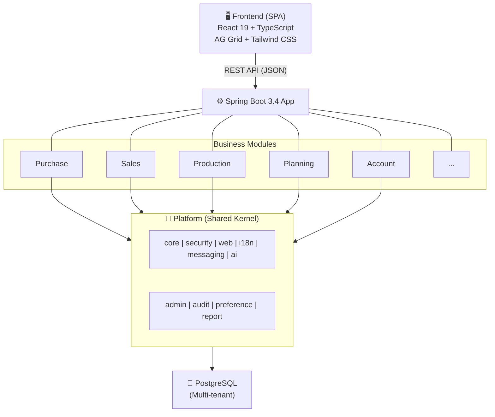
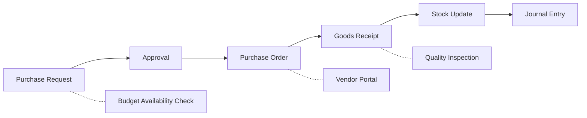
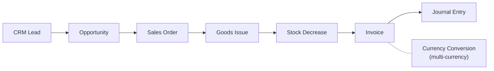
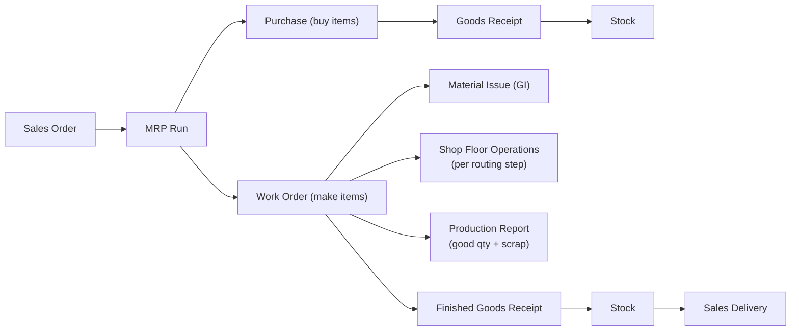
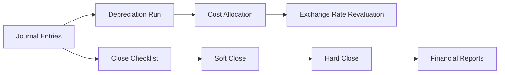
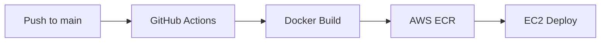

<div align="center">

# ModularERP

**Enterprise-grade, multi-tenant SaaS ERP platform with AI integration**

[](https://spring.io/projects/spring-boot)
[](https://kotlinlang.org)
[](https://react.dev)
[](https://www.typescriptlang.org)
[](https://www.postgresql.org)
[](LICENSE)
[](#testing)

---

[English](#overview) | [한국어](README.ko.md)

<br/>


</div>

---

## Overview

ModularERP is a modern, cloud-native ERP platform designed for multi-tenant SaaS deployment. Built from the ground up with clean architecture principles, it covers the full spectrum of enterprise operations — from procurement and production to finance and AI-powered analytics.

### Why ModularERP?

| Challenge | Solution |
|-----------|----------|
| Legacy ERP systems are monolithic and rigid | Modular architecture with independent business modules |
| On-premise only, expensive to deploy | Cloud-native SaaS with multi-tenant isolation |
| No AI capabilities | Built-in AI chatbot with RAG, natural language queries |
| Hard to customize per customer | Tenant-specific configuration, field permissions, workflow designer |
| Poor developer experience | Kotlin + React + TypeScript, hot reload, OpenAPI docs |

---

## Architecture



**Module Dependency Rules**

- Business modules **never depend on each other** directly
- Cross-module communication via **Port/Adapter** interfaces in `platform:core`
- Monolith today, MSA-ready tomorrow — swap adapters to REST/event clients
- Each module is an independent Gradle subproject with domain, repository, service, controller, and DTO layers

---

## Modules

### Platform Layer

| Module | Purpose |
|--------|---------|
| `platform:core` | BaseEntity, TenantEntity, DomainEvent, Port interfaces, Value Objects |
| `platform:security` | JWT auth, API key auth, rate limiting, tenant isolation, RBAC, SSO infrastructure |
| `platform:web` | ApiResponse wrapper, GlobalExceptionHandler, correlation ID, request logging |
| `platform:admin` | Tenants, roles, permissions, organizations, system codes, field permissions, menu profiles |
| `platform:ai` | AI chat service, RAG engine, natural language query, ERP tool registry, WebSocket streaming |
| `platform:report` | Excel/PDF/CSV export engine, report templates, scheduled reports |
| `platform:audit` | Audit trail logging |
| `platform:preference` | User preferences, grid column customization |
| `platform:i18n` | Multi-language translation infrastructure |
| `platform:messaging` | In-process event publisher (Kafka-ready) |

### Business Modules

| Module | Entities | Key Features |
|--------|----------|--------------|
| `master-data` | Item, Company, Plant, BOM | Multi-level BOM, phantom items, multi-language translations |
| `purchase` | PR, RFQ, PO | PR to RFQ to PO flow, PR-to-PO conversion, partial GR tracking |
| `sales` | SalesOrder | Order to ship to complete lifecycle |
| `logistics` | GoodsReceipt, GoodsIssue, StockSummary | GR/GI confirm with stock update, average cost tracking |
| `production` | WorkCenter, Routing, WorkOrder | Auto BOM/routing population, yield rate, scrap tracking |
| `planning` | MrpRun, ProductionSchedule, CapacityPlan | MRP engine with BOM explosion, net requirement calculation |
| `account` | JournalEntry, AccountMaster | Double-entry bookkeeping, balanced validation, post/reverse |
| `approval` | ApprovalRequest, WorkflowDefinition | Dynamic workflow designer, delegation, multi-step approval |
| `budget` | BudgetPeriod, BudgetItem, BudgetTransfer | Budget vs actual analysis, budget transfer, availability check |
| `asset` | Asset, DepreciationSchedule, AssetDisposal | 3 depreciation methods, batch depreciation run, disposal with gain/loss |
| `period-close` | FiscalPeriod, PeriodCloseTask, ClosingEntry | Close checklist, soft/hard close, closing entries |
| `crm` | Customer, Lead, Opportunity, Activity | Lead conversion, pipeline stages, sales funnel analytics |
| `costing` | CostCenter, StandardCost, ProductCost | BOM-based cost calculation, variance analysis, cost allocation |
| `currency` | Currency, ExchangeRate, CurrencyRevaluation | Multi-currency conversion, period-end revaluation |
| `batch` | BatchJob, BatchExecution | Scheduled jobs, execution history, retry mechanism |
| `notification` | NotificationTemplate, Notification | Multi-channel (in-app, email, SMS), template variables, preferences |
| `hr` | Employee, Department | Employee master, department hierarchy |
| `quality` | QualityInspection | Incoming/in-process/final inspection |
| `supply-chain` | SupplierEvaluation | Weighted scoring (quality, delivery, price, service) |
| `contract` | Contract | Multi-type (Purchase, Sales, NDA, Framework) |
| `document` | DocumentSequence | Atomic document numbering per type and period |

---

## Business Processes

### Procure-to-Pay (P2P)



### Order-to-Cash (O2C)



### Manufacturing



### Financial Close



---

## AI Assistant

ModularERP includes a built-in AI assistant powered by LLM with RAG (Retrieval-Augmented Generation).

| Capability | Description |
|------------|-------------|
| **Natural Language Queries** | "Show me last month's sales by customer" — parsed to ERP query automatically |
| **Report Generation** | "Generate a monthly purchase report as Excel" — creates downloadable file |
| **Permission-Aware** | AI responses filtered by user's role and data access permissions |
| **Conversation Memory** | Multi-turn conversations with full context retention |
| **12 ERP Tools** | Function calling for items, orders, stock, budgets, production, approvals |
| **Multi-Language** | Korean and English intent detection |
| **WebSocket Streaming** | Real-time token-by-token response delivery |

Accessible via floating chat widget on every page or full-screen chat interface.

---

## Tech Stack

| Layer | Technology | Version |
|-------|------------|---------|
| **Backend** | Spring Boot + Kotlin | 3.4 / 1.9 |
| **Frontend** | React + TypeScript + Vite | 19 / 5.9 / 8.0 |
| **Database** | PostgreSQL (H2 for dev) | 16 |
| **Auth** | Spring Security + JWT + API Key | — |
| **ORM** | Hibernate / JPA | 6.x |
| **Migration** | Flyway | 10.22 |
| **Data Grid** | AG Grid Community | 35.1 |
| **Styling** | Tailwind CSS | 3.4 |
| **State** | Zustand + TanStack Query | 5.x |
| **i18n** | i18next | 25.x |
| **API Docs** | OpenAPI 3.0 (Springdoc) | 2.8 |
| **AI** | LangChain4j + Claude API | 1.0-beta3 |
| **Export** | Apache POI + iText | 5.3 / 8.0 |
| **CI/CD** | GitHub Actions + Docker + AWS ECR/EC2 | — |
| **Testing** | JUnit 5 + Vitest + Playwright | — |

---

## Quick Start

### Prerequisites

- Java 17+
- Node.js 18+
- (Optional) PostgreSQL 15+

### 1. Clone and Run Backend

```bash
git clone https://github.com/Muhkeun/modular-erp.git
cd modular-erp

# Run with H2 in-memory database (zero configuration)
./gradlew :app:bootRun
```

API documentation available at `http://localhost:8080/swagger-ui.html`

### 2. Run Frontend

```bash
cd frontend
npm install
npm run dev
```

Open `http://localhost:3000`

### 3. Register and Login

```bash
curl -X POST http://localhost:8080/api/v1/auth/register \
  -H "Content-Type: application/json" \
  -d '{"tenantId":"DEFAULT","loginId":"admin","password":"admin123","name":"Admin"}'
```

Login on the frontend with tenant `DEFAULT`, ID `admin`, password `admin123`.

### Docker Compose (Production-like)

```bash
docker compose up -d
```

This starts PostgreSQL 16 and the full application with Flyway migrations.

---

## Testing

ModularERP has comprehensive test coverage across all layers.

> **191 backend tests** | **15 frontend unit tests** | **46 E2E scenarios** — All passing, 0 failures

### Backend Tests

```bash
./gradlew :app:test
```

| Category | Tests | Coverage |
|----------|-------|----------|
| Unit & Integration (CRUD, Auth) | 48 | All modules |
| E2E Business Process: P2P | 12 | PR to PO to GR to Stock to JE |
| E2E Business Process: O2C | 9 | SO to GI to Stock to JE |
| E2E Business Process: Production | 15 | BOM to WO to Material Issue to FG Receipt |
| E2E Business Process: Financial Close | 13 | Budget to Depreciation to Close |
| E2E Business Process: CRM Pipeline | 9 | Lead to Customer to Opportunity to SO |
| E2E Business Process: Multi-Currency | 8 | Exchange Rate to Revaluation |
| E2E Business Process: Budget Control | 9 | Budget to Transfer to Close |
| AI & Security | 22 | Permissions, rate limiting, tools |
| Report Engine | 10 | Excel, PDF, CSV generation |

### Frontend Tests

```bash
cd frontend
npm run test        # Vitest unit tests
npm run test:e2e    # Playwright E2E tests
```

---

## Project Structure

```
modular-erp/
|
+-- platform/                  # Shared Kernel
|   +-- core/                  # BaseEntity, ports, value objects
|   +-- security/              # JWT, API key, rate limiting, SSO
|   +-- web/                   # API response, error handler, filters
|   +-- admin/                 # Tenants, roles, orgs, system codes
|   +-- ai/                    # AI chat, RAG, tool registry
|   +-- report/                # Excel/PDF/CSV export engine
|   +-- audit/                 # Audit trail
|   +-- preference/            # User/grid preferences
|   +-- i18n/                  # Translation infrastructure
|   +-- messaging/             # Event publisher
|
+-- modules/                   # Business Modules
|   +-- master-data/           # Items, BOM, Companies, Plants
|   +-- purchase/              # PR, RFQ, PO
|   +-- sales/                 # Sales Orders
|   +-- logistics/             # GR, GI, Stock
|   +-- production/            # Work Center, Routing, Work Order
|   +-- planning/              # MRP, Capacity, Scheduling
|   +-- account/               # Journal Entries, Chart of Accounts
|   +-- approval/              # Workflow Engine, Delegation
|   +-- budget/                # Budget Periods, Items, Transfers
|   +-- asset/                 # Fixed Assets, Depreciation
|   +-- period-close/          # Fiscal Period Close
|   +-- crm/                   # Customers, Leads, Opportunities
|   +-- costing/               # Cost Centers, Standard/Product Cost
|   +-- currency/              # Multi-Currency, Exchange Rates
|   +-- batch/                 # Batch Job Processing
|   +-- notification/          # Multi-Channel Notifications
|   +-- hr/                    # Employees, Departments
|   +-- quality/               # Quality Inspections
|   +-- supply-chain/          # Supplier Evaluation
|   +-- contract/              # Contracts
|   +-- document/              # Document Numbering
|
+-- app/                       # Spring Boot main application
+-- frontend/                  # React SPA
+-- .github/workflows/         # CI/CD pipeline
+-- Dockerfile                 # Multi-stage build
+-- docker-compose.yml         # Local development
```

---

## Design Principles

| Principle | Implementation |
|-----------|---------------|
| **Multi-Tenant** | Shared database with `tenant_id` column + Hibernate `@Filter` for automatic isolation |
| **Multi-Language** | Separate `_translations` tables, frontend i18n with Korean/English |
| **Port/Adapter** | Cross-module interfaces for MSA readiness |
| **Event-Driven** | Domain events for loose coupling (in-process, Kafka-ready) |
| **Soft Delete** | `active` flag instead of hard deletes |
| **Audit Trail** | `createdAt`, `updatedAt`, `createdBy`, `updatedBy` on every entity |
| **Document Numbering** | Atomic sequence generation per type and period |
| **RBAC + Field-Level** | Role-based access + field-level read/write permissions |
| **API Key Auth** | Machine-to-machine integration with rate limiting |

---

## UX Features

- **Command Palette** — `Ctrl+K` to search pages, actions, and commands
- **Keyboard Shortcuts** — `Ctrl+N` new record, `Ctrl+S` save, `F5` refresh
- **Toast Notifications** — Non-blocking success/error/warning feedback
- **Skeleton Loaders** — Smooth loading states instead of spinners
- **Status Badges** — Consistent color-coded document status across modules
- **Error Boundaries** — Graceful error recovery with retry
- **Grid Preferences** — Column order, width, and filter persistence per user
- **Dark Mode Ready** — Tailwind CSS dark mode class support

---

## Deployment

ModularERP deploys automatically via GitHub Actions on push to `main`.



| Component | Service |
|-----------|---------|
| Container Registry | AWS ECR |
| Compute | AWS EC2 (t3.small) |
| Database | PostgreSQL (RDS or Docker) |
| Secrets | AWS Secrets Manager |
| DNS | AWS Route 53 |

---

## Configuration

Key environment variables for production:

```yaml
SPRING_DATASOURCE_URL: jdbc:postgresql://host:5432/modularerp
SPRING_DATASOURCE_USERNAME: modularerp
SPRING_DATASOURCE_PASSWORD: <secret>
MODULAR_ERP_SECURITY_JWT_SECRET: <32+ bytes>
AI_API_KEY: <anthropic-api-key>  # Optional, for AI features
```

---

## Roadmap

- [ ] Real-time SSO integration (Google, Azure AD, Okta)
- [ ] pgvector embedding for production RAG
- [ ] Mobile-responsive PWA
- [ ] Webhook integration for external systems
- [ ] Multi-database support (MySQL, Oracle)
- [ ] Kubernetes Helm chart
- [ ] GraphQL API layer
- [ ] Real-time collaboration (WebSocket presence)

---

## Contributing

Contributions are welcome. Please open an issue first to discuss the change you wish to make.

---

## License

[MIT](LICENSE)

---

<div align="center">

**Built with precision for enterprise-grade reliability.**

</div>
